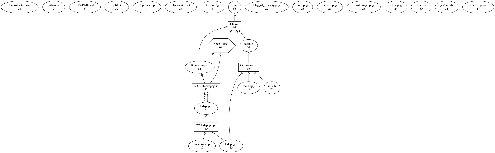

# golpng
Supports linux. Instructions for debian jessie:


prerequisites:

install tup:
```
./scripts/getTup.sh
```
install sdl:
```
sudo apt-get install libsdl1.2-dev
```

build:
```bash
tup
```

run:
```bash
./build-default/src/pics/run <path-to-image.png>
```

while running, press right to apply laplace and saturate, up to start/stop game of life and down to save picture as resultimage.png


